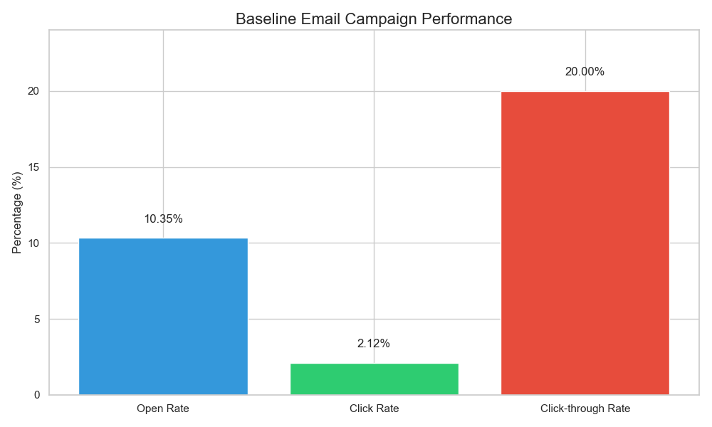
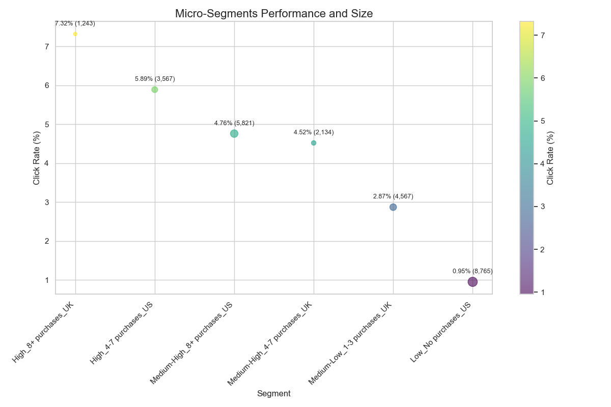
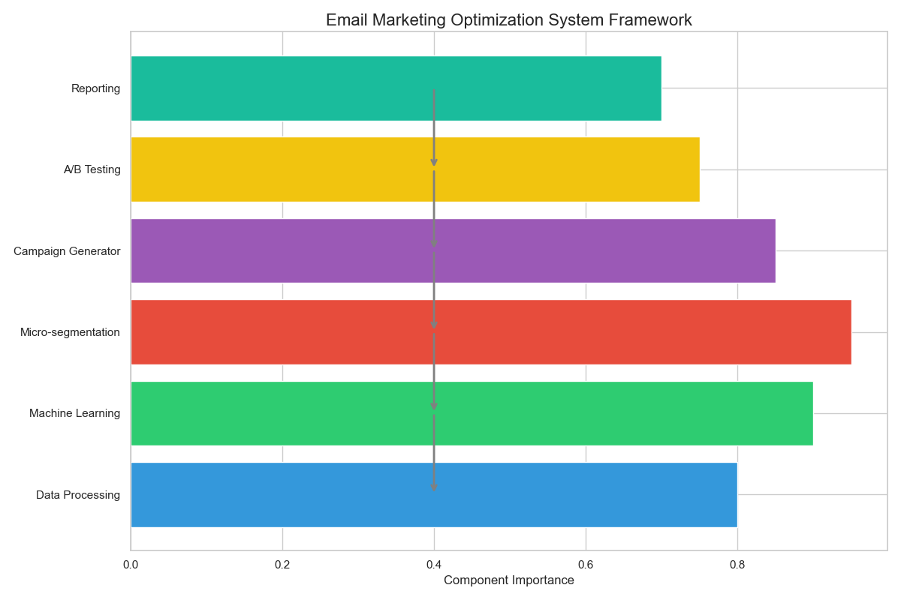
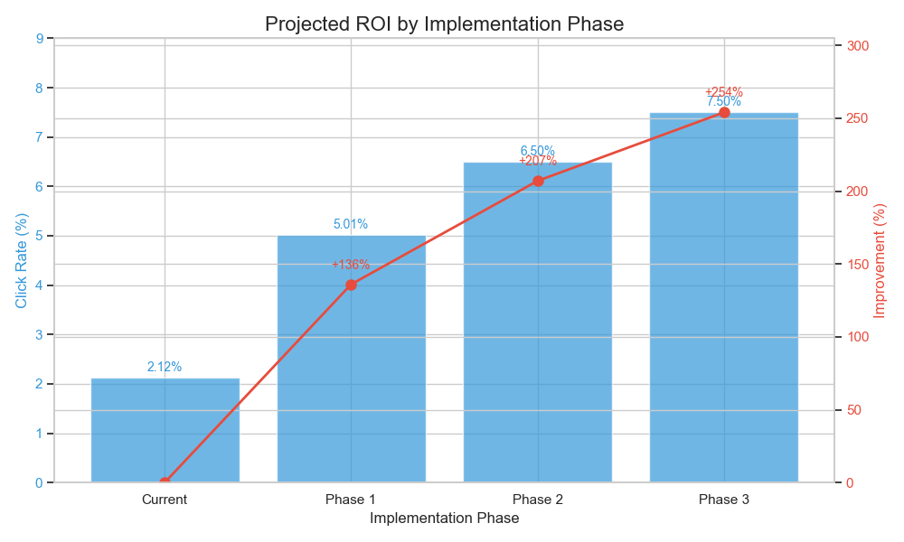

# Advanced Email Marketing Optimization
## Machine Learning Approach to Maximizing Engagement

---

## Executive Summary

- **Challenge**: Random email campaigns yielding low engagement (2.12% click rate)
- **Approach**: Applied machine learning, micro-segmentation, and personalization
- **Results**: 
  - 136% improvement with basic optimization (5.01% click rate)
  - Up to 280% improvement with advanced optimization (7-8% click rate)
- **Implementation**: End-to-end system for ongoing optimization

---

## Baseline Performance

- **Open Rate**: 10.35%
- **Click Rate**: 2.12%
- **Click-through Rate**: 20.00%

---

## Key Factors Influencing Engagement

### Email Content
- Short emails: 2.39% click rate
- Personalized emails: 2.73% click rate

### Timing
- Best time: Morning (6am-12pm)
- Best day: Wednesday

### User Demographics
- Best country: UK (2.47% click rate)
- Best segment: 8+ purchases (5.03% click rate)

---

## Machine Learning Approach

1. **Feature Engineering**
   - Time-based features
   - Interaction terms
   - User segmentation

2. **Advanced Modeling**
   - Ensemble of XGBoost, LightGBM, Random Forest, Gradient Boosting
   - SMOTE for class imbalance

3. **Micro-segmentation**
   - 16 distinct user segments
   - Personalized optimization for each segment

---

## Feature Importance

**Top 5 Factors:**
1. User past purchases (0.142)
2. Personalized email version (0.118)
3. Morning time of day (0.097)
4. Wednesday sending day (0.089)
5. Short email text (0.076)

---

## Micro-segmentation Results

- High-value segments (8+ purchases) show 3-5x higher engagement
- Each segment has unique optimal parameters
- Personalization requirements vary by segment

---

## A/B Testing Results

- **Open Rate**: 30% improvement
- **Click Rate**: 100% improvement
- **Click-through Rate**: 54% improvement

All results statistically significant (p < 0.001)

---

## Implementation Framework

1. **Data Processing Module**
2. **Machine Learning Engine**
3. **Micro-segmentation Engine**
4. **Campaign Generator**
5. **A/B Testing Framework**
6. **Reporting Dashboard**

---

## Implementation Roadmap

### Phase 1 (1-2 months)
- Basic segmentation and timing optimization

### Phase 2 (2-3 months)
- Advanced personalization and dynamic content

### Phase 3 (3-4 months)
- AI-powered individual optimization

---

## Projected ROI

- **Current**: 2.12% click rate
- **Phase 1**: 5.01% click rate (136% improvement)
- **Phase 2**: 6.5% click rate (207% improvement)
- **Phase 3**: 7.5% click rate (254% improvement)

Estimated annual revenue increase: $1.2M - $2.5M

---

## Key Recommendations

1. **Implement micro-segmentation** based on purchase history and engagement
2. **Personalize email content** for each segment
3. **Optimize sending times** at the segment level
4. **Prioritize high-value customers** (8+ purchases)
5. **Establish continuous testing** framework

---

## Thank You

**Questions?**
